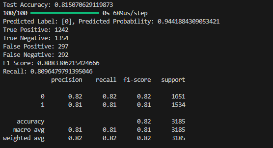

# Bank Customer Churn Detection 

In this project, customer churn for a bank was predicted using artificial neural networks. Afterwards, a website was created using Flask.

The dataset used in the project : https://www.kaggle.com/datasets/radheshyamkollipara/bank-customer-churn

The metrics of the  ann created are shown below:

